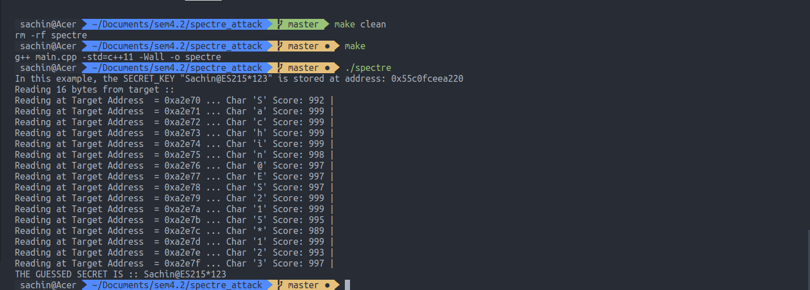
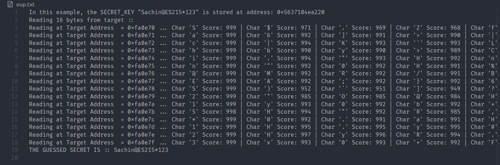
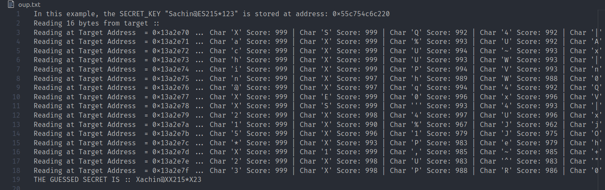
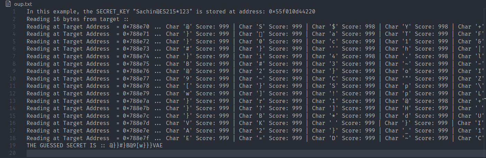

# SPECTRE ATTACK Variant 1

SPECTRE attack leverage the speculative Execution in modern processors. All the modern machines which use branch predictors are vulnerable to these attacks. Discovered by Google Zero team in 2017 and publicly announced in January 2018, Spectre and Meltdown mitigations has caused slowdown in the vulnerable machine.

Spectre attack is not a single security vulnerability, but a family of them. Here in this code, I have implemented the Conditional Branch variant, 'Variant 1' of Spectre attacks, which is to bypass the bounds check in the target program.

## File Structure

```shell
.
├── main.cpp
├── Makefile
├── presentation.pdf
└── README.md
```

## Steps in the Spectre attack:

1. First the memory location of the target data must be known, using it we calculate the offset of the target data and accessible array pointers in memory.
2. For every byte of the data, we repeat the steps 2 to 8.
3. First we train the branch predictor by giving values which comply with the check bounds, making the branch predictor predict that the branch will be taken in future.
4. Now we make a malicious attack, that we pass a value to the target function which is out of bounds, that is the offset between the accessible array and target address in memory. The branch predictor now predicts branch taken.
5. As the branch predictor, now predicts the branch taken. The memoery at address array1 + offset gets prefetched into the cache.
6. After the memory is in the cache, we perform the 'timing attack'. For every character/byte between 0 to 255, we check the cycles it takes to fetch it from memory. If it is less or equal to the time threshold, then we assume that the data is in Cache, otherwise not.
7. We repeat step 3 to step 6, multiple times. In every try, we check for all the 256 values in the byte memory. Using the step 6, we calculate the scores for every value in 0 to 256, denoting its likeliness to be at the target data.
8. Now we sort the results in descending order to get the top scores.
9. Now based on the scores and results for every byte we make the best guess.

## Running the Files

1. Complile the file
   ```shell
   $ make
   ```
2. Run the file directly
   ```shell
   $ ./spectre
   ```

## Program Structure in main.cpp

### Target Program

The target program has data stored in two arrays, arr1 and arr2. There is a string data names secret. Fetching this secret data from the Target Program is the main goal of the attacker.

- **fetch_function**: This function is the main function in the target programs. This takes input of the index of array data to fetch. It checks the bounds first and returns the data if index parameter comply to the check bounds. Otherwise it returns -1 or NULL. Our goal is to use the bound check here to train the branch predictor and bypass the bounds checks to fetch the data at the desired location.

### Analyzing or Attacking Program

- **init_attack**: It initialized the attack pattern, so instead of going in order of A -> B -> C.. in the sequential order, we have randomly shuffled the attack pattern in some random sequence G -> Y -> C ... . Also for making decision whether to pass a index which is in bounds or a malicous target, we use multiplication with boolean array to make the decision, which is a workaround of the if-else clause as we need to avoid if-else to make attacking decisions as it can trigger branch predictor.
- **readMemoryByte**: It is the main attacking/analyzing function. It performs multiple tries for the given Byte. In every try:

  - Flush the array2 out of the cache memory.
  - We then train the branch predictor (ATTACK_LEAP - 1) times with correct bounds.
  - Then in the ATTACK_LEAP-th attack, we pass a target/malicious target to fetch the target memory in cache.
  - For every character in 0 to 255:
    - Check whether the prefetched cache memory is in correspondence to this character by performing a timing attack at that location.
    - If the cycles are less or equal to the CACHE_HIT_THRESHOLD, then the memory was in Cache. Increase score for this character by 1.
  - Finally sort the results in descending order to get the topmost results.

- **main function**
  - It first call the init_attack function in the beginning to initialize the attack pattern.
  - Calculate the required offset for the target address.
  - For every byte of the target memory:
    - Calls the readMemByte function
    - Prints the results whose scores are above LIKELY_THRESHOLD
    - Adds the best result to the final guess output
  - Prints the final guess outcome

## Main Parameters in the Analyzing Function
- **CACHE_HIT_THRESHOLD**: Assume that the memory address is in Cache, if time is <= CACHE_HIT_THRESHOLD
- **NUM_TRIES**: The task of attacking and analysing is done NUM_TRIES times, then score is prepared for each character out of NUM_TRIES
- **TRAINING_LOOPS**: The number of training loops (mistraing loops + attacking loops)
- **ATTACK_LEAP**: 1 in every ATTACK_LEAP of the TRAINING_LOOPS will be an attacking loop i.e. mistraining_loops = (TRAINING_LOOPS)/ATTACK_LEAP
- **LIKELY_THRESHOLD**: I assume that the characters with more than LIKELY_THRESHOLD hit rate are in the SECRET

## Screenshots
- **Result at Cache Threshold 80**
  
- **Result at Cache Threshold 400**
  
- **Result at Cache Threshold 800**
  
- **Result at Cache Threshold 1200**
  


## Resources for Spectre Attack

Check out these resources to learn more about Spectre attacks:

- Papers
  - [Spectre Attacks: Exploiting Speculative Execution](https://spectreattack.com/spectre.pdf)
- YouTube Videos
  - [Spectre and Meltdown: Data leaks during speculative execution | J. Horn (Google Project Zero)](https://youtu.be/6O8LTwVfTVs)
  - [Spectre Attacks Exploiting Speculative Execution -- IEEE Symposium](https://youtu.be/zOvBHxMjNls)
- Websites
  - [Meltdown and Spectre](https://spectreattack.com/)
